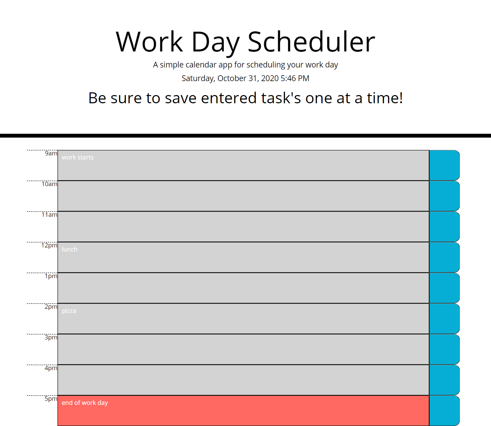

# 05 Work-day-scheduler #
## User Story ##
* This project enables a user to better manage their daily routines!
* Starting to understand exactly what functions and specifically arguments and parameters do
* Jquery makes code a lot more compacted and dials down on amount of coding required
* Moment.js is a great library to use when dealing with dates and times
* How to properly structure a Java page (global variables on top, function calling, and then function deffinitions)
## Features ##
* Enter a task that you need accomplished into the alloted time slots
* Remeber to save your entered task's one at a time before entering another. (enter task, click save button, enter task, click save button...etc)
* The time blocks CSS will update automatically based upon time of day
* Page tasks will reset automatically when a new day starts
* The current day in the Header of the page will update automatically upon refresh
## Installation ##
1. Open up git bash terminal
2. Change directory to desired location (%User Profile%/SourceRepo)
3. Clone the repository (git clone git@github.com:ChristianGoldman/Work-day-scheduler.git)
## Usage ##
1. Open index.html in browser.
2. Should see a page like this.

## Credits ##
* Cwerness gitlab
* https://www.w3schools.com/js/default.asp
* https://validator.w3.org/
* https://www.w3schools.com/js/js_json.asp
* https://momentjs.com/
* https://momentjs.com/docs/
* Tutor Makism
* BCA learning assistants
* TA's Paul Hendrickson, Tommy Boone, Jake O'Thoole, Daniel Thao
## Link to deployed application ##
* https://christiangoldman.github.io/Work-day-scheduler/
## License ##
    MIT License

    Copyright (c) [2020] [Christian Goldman]

    Permission is hereby granted, free of charge, to any person obtaining a copy
    of this software and associated documentation files (the "Software"), to deal
    in the Software without restriction, including without limitation the rights
    to use, copy, modify, merge, publish, distribute, sublicense, and/or sell
    copies of the Software, and to permit persons to whom the Software is
    furnished to do so, subject to the following conditions:

    The above copyright notice and this permission notice shall be included in all
    copies or substantial portions of the Software.

    THE SOFTWARE IS PROVIDED "AS IS", WITHOUT WARRANTY OF ANY KIND, EXPRESS OR
    IMPLIED, INCLUDING BUT NOT LIMITED TO THE WARRANTIES OF MERCHANTABILITY,
    FITNESS FOR A PARTICULAR PURPOSE AND NONINFRINGEMENT. IN NO EVENT SHALL THE
    AUTHORS OR COPYRIGHT HOLDERS BE LIABLE FOR ANY CLAIM, DAMAGES OR OTHER
    LIABILITY, WHETHER IN AN ACTION OF CONTRACT, TORT OR OTHERWISE, ARISING FROM,
    OUT OF OR IN CONNECTION WITH THE SOFTWARE OR THE USE OR OTHER DEALINGS IN THE
    SOFTWARE.